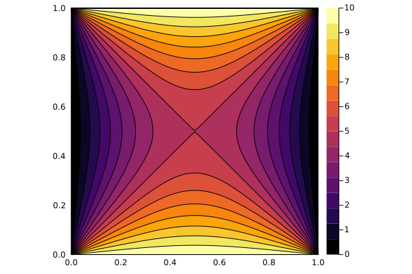

# Project 2


Laplace's equation is a second-order partial-differential equation that can be used to describe many phenomenon in science and engineering.  In two-dimensions it has the homogeneous form

$$
\frac{\partial^2 u(x,y)}{\partial x^2} + \frac{\partial^2 u(x,y)}{\partial y^2} = 0.
$$

Physically, this might represent a steady state heat conduction or a pressure diffusivity problem.   You can use an iterative procedure with a finite difference scheme to arrive at the steady-state solution.  I have implemented such a solver in the file [project2.jl](project2.jl).  To run this code in serial from the command line

```bash
julia --project=. -e "using project2; run_serial()"
```

which will produce

  


with constant boundary conditions $u=10$ applied to both the top and bottom.

For this project, you'll use the serial implementation as a reference to implement a parallel method with [MPI.jl](https://juliaparallel.github.io/MPI.jl/latest/usage/). In the file [project2.jl](src/project2.jl), you'll need to implement the following functions:

 * `partition_data(g::Grid, comm::MPI.comm)::Grid`:  This function should take a `Grid` type that has been instantiated on rank 0 and distribute the *columns* of the underlying `Grid` data structure as equally as possible among all the processors.  If the number of columns is not equally divisible by the number of processors, any "extra" columns should be equally distributed starting with rank 0.  For example, if the input `Grid` has 10 columns and you run the simulation on 3 ranks, rank 0 should have 4 columns from the original grid, and ranks 1 and 2 should have 3 columns each from the original grid.  If the `Grid` has 8 columns and you run the simulation on 3 ranks, ranks 0 and 1 should have 3 columns each and rank 2 should have 2 columns from the original grid.  In addition to the columns from the original grid, you'll need to "pad" the partitioned `Grids` with a column of 0's that will act as boundary conditions for the iteration.  The rank 0 processor should have a padded column of 0's on the right side, the last processor, i.e. `rank = size-1`, should have a padded column of 0's on the left side, all other ranks should have padded columns of 0's on both sides of the original data.  This padding technique is often called "ghosting".  This function should return `Grid` types on each processor.
 
 * `solve!(g::Grid, comm::MPI.comm)`:  This function should call `iterate!(g::Grid)` for each partitioned grid.  Before calling `iterate!()`, you will need to use `Send()` and `Recv!()` calls to send the left/right columns from adjacent processors when needed to act as "boundary conditions" on the local (to processor) grids.  You should then be able to call the `iterate!()` function without modifications.  Keep in mind that the error returned from `iterate!()` will only be the error for each local grid, but you want to stop iterating only once the global error is below tolerance. You will need to devise a scheme to compute and communicate the global errors to each processor so they will all stop iterating at the same time. It's probably not necessary to perform this communication every single iteration.

 * `get_solution!(g::Grid, my_g::Grid, comm::MPI.comm)` should gather the total solution back to the rank 0 processor in the `u` field of `g`. Be careful not to double include any of the data you may have "ghosted" during the iteration.
 
With these functions implemented correctly, you should be able to run the following Terminal command from the root of the project repository

```bash
$HOME/.julia/bin/mpiexecjl --project -np 2 julia -e "using project2; run_parallel()"
```

to run the simulation in parallel.  If successful it will create a file `laplace_parallel.png` in the repository that can be used for visual inspection of the results.

## Testing

To see if your answer is correct, run the following command at the Terminal command line from the repository's root directory

```bash
julia --project=. -e "using Pkg; Pkg.test()"
```

the tests will run and report if passing or failing.
